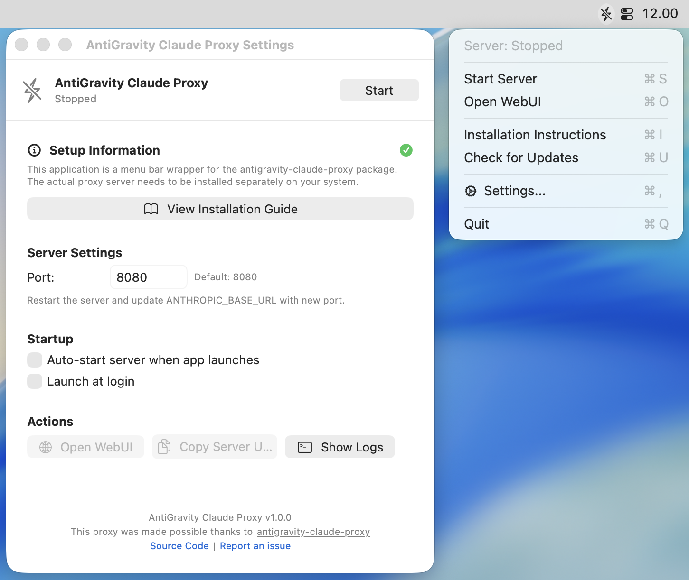
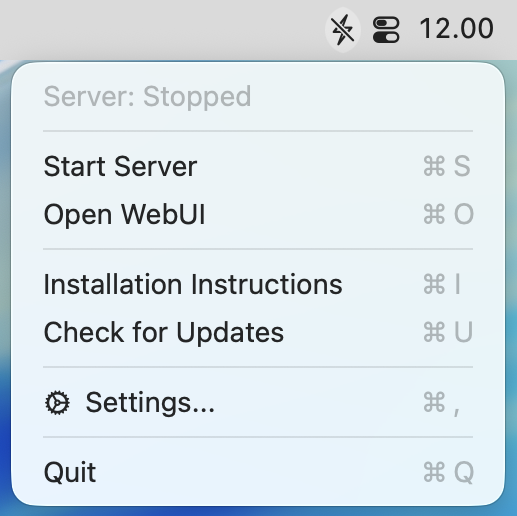
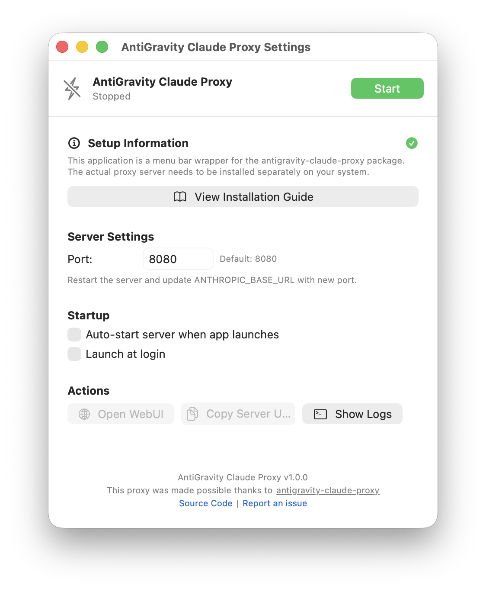

# AntiGravity Claude Proxy Bar

<p align="center">
  
</p>

<p align="center">
<a href="https://github.com/IrvanFza/antigravity-claude-proxy-bar/blob/main/LICENSE"></a>
<a href="https://github.com/IrvanFza/antigravity-claude-proxy-bar"></a>
</p>

**A beautiful native macOS menu bar application for managing the AntiGravity Claude Proxy server.**

This app is a convenient wrapper around [antigravity-claude-proxy](https://github.com/badrisnarayanan/antigravity-claude-proxy), providing an easy-to-use menu bar interface to start, stop, and configure your proxy server. No need to deal with terminal commands – just click and go!

Built with Swift and SwiftUI, it offers a native macOS experience with automatic updates via Sparkle framework.

<p align="center">
  
</p>

## Features

- 🎯 **Native macOS Experience** - Clean, native SwiftUI interface that feels right at home on macOS
- 🚀 **One-Click Server Management** - Start/stop the antigravity-claude-proxy server from your menu bar
- ⚡ **Installation Check** - Automatically detects if antigravity-claude-proxy is installed with helpful guidance if not
- 📋 **Installation Instructions** - Quick access to installation guide via menu bar (⌘I) or settings
- 🔄 **Auto-start** - Optionally start the server automatically when the app launches
- 🌐 **Quick WebUI Access** - Open the proxy web interface with one click
- ⚙️ **Configurable Port** - Set custom port for the proxy server (default: 8080)
- 🔔 **Notifications** - Get notified when the server starts, stops, or encounters errors
- 🚦 **Status Indicator** - Menu bar icon shows server status (bolt icon: green when running, gray when stopped)
- 🔄 **Automatic App Updates** - Built-in update checker using Sparkle framework
- 🎨 **Beautiful Icons** - Custom icons with template rendering for perfect menu bar integration
- 💾 **Launch at Login** - Start the app automatically when you log in to macOS

## Installation

### Prerequisites

**⚠️ Important:** This app requires the `antigravity-claude-proxy` npm package to be installed separately. The app will guide you through installation if it's not detected.

Install `antigravity-claude-proxy` globally:

```bash
npm install -g antigravity-claude-proxy
```

Or use it via npx (the app will detect and use npx if the global package is not found).

For more information, see the [antigravity-claude-proxy installation guide](https://github.com/badrisnarayanan/antigravity-claude-proxy).

### Download Pre-built Release (Recommended)

1. Go to the [**Releases**](https://github.com/IrvanFza/antigravity-claude-proxy-bar/releases) page
2. Download the latest `AntiGravityClaudeProxy.zip`
3. Extract and drag `AntiGravity Claude Proxy.app` to `/Applications`
4. Launch AntiGravity Claude Proxy

### Build from Source

Want to build it yourself?

#### Requirements

- macOS 13.0 or later
- Xcode Command Line Tools
- Swift 5.9+

#### Build the App

```bash
# Build and create the app bundle
make build

# Or run the build script directly
./create-app-bundle.sh
```

#### Install

```bash
# Install to /Applications
make install
```

#### Run

```bash
# Run the app
make run

# Or open directly
open "AntiGravity Claude Proxy.app"
```

## Usage

### First Launch

1. Launch AntiGravity Claude Proxy - you'll see a menu bar icon (bolt)
2. If antigravity-claude-proxy is not installed, you'll see a notification with instructions
3. Once installed, click the menu bar icon and select "Start Server" (or press ⌘S)
4. The icon will turn green when the server is running

### Menu Bar Options



| Menu Item                     | Shortcut | Description                                           |
| ----------------------------- | -------- | ----------------------------------------------------- |
| **Status**                    | -        | Shows current server status and port number           |
| **Start/Stop Server**         | ⌘S       | Toggle the proxy server on/off                        |
| **Open WebUI**                | ⌘O       | Opens the web interface in your default browser       |
| **Installation Instructions** | ⌘I       | Opens the antigravity-claude-proxy installation guide |
| **Check for Updates**         | ⌘U       | Check for app updates                                 |
| **Settings...**               | ⌘,       | Opens the settings window                             |
| **Quit**                      | ⌘Q       | Stops the server and exits the app                    |

### Settings Window



**Setup Information Section**

- Explains that this app is a wrapper for antigravity-claude-proxy
- Shows installation status with checkmark when installed
- Provides quick access to installation guide

**Server Settings**

- **Port**: Configure the port number for the proxy server (default: 8080)
- Changes require server restart to take effect

**Startup Options**

- **Auto-start server**: Automatically start the server when the app launches
- **Launch at login**: Start the app automatically when you log in to macOS

**Actions**

- **Open WebUI**: Launch the web interface (only enabled when server is running)
- **Copy Server URL**: Copy `http://localhost:PORT` to clipboard
- **Show/Hide Logs**: Toggle real-time server logs display

### Server Logs

View real-time server output by clicking "Show Logs" in the settings window. Logs are color-coded:

- Normal output: Default text color
- Errors: Red text
- Maximum 500 lines kept in memory

## Configuration

The app uses the same configuration as the `antigravity-claude-proxy` package:

- Config file: `~/.config/antigravity-proxy/config.json`
- Accounts: `~/.config/antigravity-proxy/accounts.json`

Refer to the [antigravity-claude-proxy documentation](https://github.com/badrisnarayanan/antigravity-claude-proxy) for configuration options.

## Want to Contribute?

Contributions are welcome! Whether you're fixing bugs, adding features, improving documentation, or sharing ideas, your help is appreciated.

### Getting Started

1. **Fork the repository** and clone your fork
2. **Install dependencies** - You'll need:
   - macOS 13.0 or later
   - Xcode Command Line Tools
   - Swift 5.9+
   - `antigravity-claude-proxy` npm package for testing
3. **Make your changes** in a new branch
4. **Test your changes** thoroughly
5. **Submit a pull request** with a clear description of what you've changed and why

### Development Commands

```bash
# Quick development build (debug mode)
make dev

# Full release build
make build

# Install to /Applications for testing
make install

# Clean build artifacts
make clean

# Test compilation only
make test-build

# Run the app
make run
```

### Project Structure

```
antigravity-claude-proxy-bar/
├── src/
│   ├── Sources/
│   │   ├── main.swift             # App entry point
│   │   ├── AppDelegate.swift      # Menu bar and window management
│   │   ├── ServerManager.swift    # Server process control & installation check
│   │   ├── SettingsView.swift     # SwiftUI settings UI
│   │   ├── Constants.swift        # App constants (URLs, etc.)
│   │   └── Resources/
│   │       ├── AppIcon.icns       # App icon
│   │       ├── icon-active.png    # Menu bar icon (server running)
│   │       └── icon-inactive.png  # Menu bar icon (server stopped)
│   ├── Package.swift              # Swift Package Manager config
│   └── Info.plist                 # macOS app metadata
├── create-app-bundle.sh           # Build script
├── Makefile                       # Build automation
└── README.md                      # This file
```

### Key Components

- **AppDelegate**: Manages the menu bar item, settings window, and app lifecycle
- **ServerManager**: Controls the antigravity-claude-proxy process, checks installation status, and manages logs
- **SettingsView**: SwiftUI interface with native macOS design and real-time status updates
- **Constants**: Centralized constants including GitHub URLs for installation instructions
- **Sparkle Integration**: Automatic update checking and installation

### Technical Details

**Installation Detection**

The app intelligently searches for `antigravity-claude-proxy` in multiple locations:

- Common system paths (`/usr/local/bin`, `/opt/homebrew/bin`, `/usr/bin`)
- Node version managers (Volta, fnm, asdf, NVM)
- Global package managers (npm, pnpm, yarn)
- Falls back to `npx` if the global package is not found

**Architecture**

- Built with Swift and SwiftUI for native macOS performance
- Uses Combine framework for reactive UI updates
- Sparkle framework for automatic app updates
- Process management via Foundation's Process API

### Reporting Issues

Found a bug or have a feature request? Please [open an issue](https://github.com/IrvanFza/antigravity-claude-proxy-bar/issues) with:

- Clear description of the issue or feature
- Steps to reproduce (for bugs)
- Expected vs actual behavior
- Your macOS version and app version
- Relevant logs or screenshots

## Credits

This app is built as a native macOS wrapper around [antigravity-claude-proxy](https://github.com/badrisnarayanan/antigravity-claude-proxy), an excellent proxy server for Claude AI.

**Special thanks to:**

- **[antigravity-claude-proxy](https://github.com/badrisnarayanan/antigravity-claude-proxy)** - The core proxy server that powers this application
- **[VibeProxy](https://github.com/automazeio/vibeproxy)** - The inspiration for this project. The entire app structure, build setup, and code architecture were adapted from VibeProxy's excellent implementation.

Without these two excellent projects, this app wouldn't exist. Thank you to the maintainers and contributors of both projects!

## License

MIT License - see [LICENSE](LICENSE) file for details

---

Made with ⚡ by [IrvanFza](https://irvan.cc)
